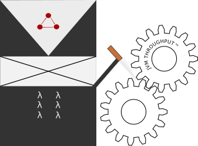

# The butler did it!




This is a library and a set tools aimed to find performance issues derived from JVM monitors locks by taking the output yielded by

```
jstack -l <PID> 
```

... parsing it and generating useful representations of the lock dependencies between threads. 

- **As a multiplatform library:** It offers [an ADT for threads](https://github.com/pfcoperez/thebutlerdidit/tree/master/shared/src/main/scala/org/pfcoperez/thebutlerdidit/model) and a set of parsers to generate instances of this ADT out of the outputs of `jstack`.
It also comes with a simple sparse graph implementation (which offers methods to render them into [DOT Graphviz](https://graphviz.org/pdf/dotguide.pdf) documents) 

- **An interactive all-in-browser app:** It allows to easily ~write~ paste the outputs of `jstack -l` and generate graphical representations of the lock relations between threads. In these representations, **each node is a thread** and each **arrow a lock request to an object** (whose reference is the label of the arrow) **owned by** another thread, **the target node of the arrow**.  [This app has been implemented in Scala](https://github.com/pfcoperez/thebutlerdidit/tree/master/js/src/main/scala/org/pfcoperez/thebutlerdidit), using [Scala.js](https://www.scala-js.org/). 

- **As a JVM application:** Command line counterpart of the web application.

The graphic UI is actually the driver of this project, the application I wanted to have to help me  with my daily challenges as software engineer. Ironically, the most curated parts of the project, its engines, are the: The reports parser, the ADT and the sparse graph DOT document generations and not the web UI.

:warning: The parsers over-fit to the samples under https://github.com/pfcoperez/thebutlerdidit/tree/master/jvm/src/test/resources/samples , if you use this application and you find reports from `jstack` that are not parsed, I ask you to please open a PR uploading the sample :pray:. I will update the parser as soon as possible! 

## Features

- Browser application:

  - [x] Parse input.
  - [x] DOT representation output.
  - [x] Graphic SVG representation of the threads and their locks relations.
  - [x] Interactive changes of render parameters: Such as render engine for GraphViz or the inclusion of isolated threads.
  - [ ] Export SVG graph (download button).
  - [ ] Fill the input with the contents of the clipboard.
  - [ ] Better navigation through the SVG graph.

- Library:

  - [x] Parsers for `jstack` outputs (in contrast to `jstack -l`).
  - [x] Sparse graph implementation.
  - [x] Render graphs as DOT documents.
  - [x] Multiplatform: [Scala.js](https://www.scala-js.org/)

- Command line application:

  - [x] Simple standard input processor spilling out DOT code into the standard output, no options or fancy stuff.
  - [ ] Options and a proper parser for them: Different outputs, attributes for nodes, ...
  - [ ] Render into image files.

## Contributing

Contributions are more than welcome! There are three ways of helping to improve this free and open application/library: Providing samples, adding features or requesting features.

### Samples

The fast track to contributing is as easy as it is important: Have you found an output of `jstack -l` which doesn't parse with this tool? 
_Yes!_ Open a PR adding that raw output as a file named `sampleXY` under https://github.com/pfcoperez/thebutlerdidit/tree/master/jvm/src/test/resources/samples

Your PR should fail to pass CI because you'll be automatically adding a test case for an input that the parsers don't support. At this point you have two options:

1. Take no more actions: This contribution would be massive already! Just let me know that you don't want to fix the parsers for me and I'll do it.
2. Fix the parser in the same PR: You will be like [Muad'Dib](https://en.wikipedia.org/wiki/Paul_Atreides) to me. :bow:

### Features

Anything you want to add will be welcome as long as it keeps the WebUI app away from servers to talk to!
I regard opening issues either asking for features or finding bugs as contributions too.